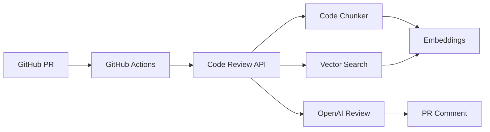

# Code Review API

An intelligent code review system powered by llms that provides contextual feedback on pull requests. Built with Bun, Hono, and OpenAI embeddings.

> **Note:** This project is currently heavily optimized for SvelteKit projects, with specialized parsing for Svelte components, SvelteKit routing patterns (+page, +layout), and built-in Svelte 5 knowledge base.

## Features

- **Contextual Code Analysis** - Uses vector embeddings to find relevant code patterns and context
- **GitHub Actions Integration** - Automatically reviews PRs with detailed feedback
- **Knowledge Base Support** - Includes framework-specific knowledge (Svelte 5, etc.)
- **Multi-language Support** - TypeScript, JavaScript, Svelte, CSS, Markdown, and more
- **Fast & Efficient** - Built with Bun for maximum performance
- **Docker Ready** - Easy deployment with persistent storage

## Architecture



## Quick Start

### 1. Clone and Setup

```bash
git clone https://github.com/Dave-lab12/pr-review-bot/
cd pr-review-bot
cp .env.example .env
```

### 2. Environment Variables

```env
# Required
OPENAI_API_KEY=your_openai_api_key
GITHUB_SECRET_KEY=your_key_to_authenticate_to_the_backend
GITHUB_ACCESS_TOKEN=give_github_access_to_read_the_repo
GEMINI_API_KEY=your_gemeni_api_key

# Optional
CHUNKS_DIR=/contents/mindplex-chunks
TEMP_DIR=/tmp
NODE_ENV=production
```

### 3. Run with Docker

```bash
# Development
docker-compose --profile dev up

# Production
docker-compose up
```

### 4. Initialize Codebase

```bash
curl -X POST http://localhost:3000/update-codebase \
  -H "Content-Type: application/json" \
  -H "x-github-secret: your_secret" \
  -d '{"repoUrl": "https://github.com/your/repo", "branch": "main"}'
```

## API Endpoints

### Health Check
```http
GET /
```

### Update Codebase
Clones and processes a repository, creating embeddings for code chunks.

```http
POST /update-codebase
Content-Type: application/json
x-github-secret: your_secret

{
  "repoUrl": "https://github.com/user/repo",
  "branch": "main",
  "token": "optional_github_token"
}
```

### Review Code
Reviews code changes against the processed codebase.

```http
POST /review
Content-Type: application/json
x-github-secret: your_secret

{
  "files": [
    {
      "fileName": "src/app.ts",
      "changedCode": "function example() { ... }"
    }
  ],
  "description": "Add new feature"
}
```

**Single file format:**
```json
{
  "changedCode": "function example() { ... }",
  "fileName": "src/app.ts",
  "description": "Add new feature"
}
```

## GitHub Actions Integration

### Setup

1. **Add Repository Secrets:**
   - `REVIEW_API_URL` - Your API endpoint
   - `REVIEW_SECRET` - Your GitHub secret key

2. **Add Workflow File** (`.github/workflows/code-review.yml`):

```yaml
name: Code Review

on:
  pull_request:
    types: [opened, synchronize, reopened]

jobs:
  review:
    runs-on: ubuntu-latest
    steps:
      - uses: actions/checkout@v4
        with:
          fetch-depth: 0

      - name: Review and post
        env:
          REVIEW_API_URL: ${{ secrets.REVIEW_API_URL }}
          REVIEW_SECRET: ${{ secrets.REVIEW_SECRET }}
          GH_TOKEN: ${{ secrets.GITHUB_TOKEN }}
        run: |
          temp_files=()
          while IFS= read -r file; do
            if [[ -f "$file" && $(wc -c < "$file") -le 1048576 ]]; then
              content=$(cat "$file" | jq -R -s .)
              temp_file=$(mktemp)
              jq -n --arg filename "$file" --argjson content "$content" '{"fileName": $filename, "changedCode": $content}' > "$temp_file"
              temp_files+=("$temp_file")
            fi
          done < <(git diff --name-only origin/${{ github.base_ref }}...HEAD)

          if [ ${#temp_files[@]} -eq 0 ]; then
            review="No files to review"
          else
            files_json=$(jq -s . "${temp_files[@]}")
            rm -f "${temp_files[@]}"

            response=$(curl -s -f -X POST "$REVIEW_API_URL/review" \
              -H "Content-Type: application/json" \
              -H "x-github-secret: $REVIEW_SECRET" \
              -d "{\"files\": $files_json, \"description\": \"PR #${{ github.event.number }}: ${{ github.event.pull_request.title }}\"}")

            if [ $? -eq 0 ] && [[ $(echo "$response" | jq -r '.success') == "true" ]]; then
              review=$(echo "$response" | jq -r '.review')
            else
              review="Review failed: $(echo "$response" | jq -r '.error // "API error"')"
            fi
          fi

          gh api repos/${{ github.repository }}/issues/${{ github.event.number }}/comments \
            --method POST \
            --field body="## 🤖 Code Review

          $review"
```

## Knowledge Files

Add framework-specific knowledge to improve reviews:

1. **Create knowledge files** in `src/prompts/`:
   ```
   src/prompts/svelte5.txt
   src/prompts/react19.txt
   ```

2. **Format with sections:**
   ```markdown
   # Svelte 5 Knowledge
   
   ## Runes
   Svelte 5 introduces runes for state management...
   
   ## Components  
   New component syntax and features...
   ```

3. **Update parser** to include new files:
   ```typescript
   const knowledgeFiles = [
     'svelte5.txt',
     'react19.txt'  // Add new files here
   ];
   ```

## Supported File Types

- **Code**: `.ts`, `.js`, `.svelte`
- **Styles**: `.css` 
- **Config**: `.json`, `.yml`
- **Docs**: `.md`, `.txt`, `.html`

## Deployment

### Render.com

1. **Connect your repository**
2. **Set environment variables**
3. **Enable persistent disk** (10GB recommended)
4. **Deploy**

### Docker Production

```bash
# Build
docker build -t code-review-api .

# Run with volume
docker run -d \
  --name code-review \
  -p 3000:3000 \
  -v ./contents:/contents \
  -e OPENAI_API_KEY=your_key \
  -e GITHUB_SECRET_KEY=your_secret \
  code-review-api
```

## Configuration

### File Paths
```typescript
{
  codebaseRoot: process.env.CODEBASE_ROOT || process.cwd(),
  chunksDir: process.env.CHUNKS_DIR || '/contents/mindplex-chunks',
  schemaFile: 'schema.json',
  embeddingsFile: 'embeddings.json',
  promptsDir: 'src/prompts',
  tempDir: process.env.TEMP_DIR || '/tmp'
}
```

### Parsing Options
```typescript
{
  supportedFileTypes: ['ts', 'svelte', 'js', 'json', 'css', 'html', 'md', 'txt', 'yml'],
  embedding: {
    model: 'text-embedding-3-small',
    batchSize: 100,
    rateLimitDelay: 1000
  }
}
```

## Usage Examples

### Manual Code Review
```bash
curl -X POST http://localhost:3000/review \
  -H "Content-Type: application/json" \
  -H "x-github-secret: your_secret" \
  -d '{
    "changedCode": "function handleLogin(email: string, password: string) { const response = fetch(\"/api/auth\", { method: \"POST\", body: JSON.stringify({ email, password }) }); return response.json(); }",
    "fileName": "auth.ts",
    "description": "Added login function"
  }'
```

### Update Codebase
```bash
curl -X POST http://localhost:3000/update-codebase \
  -H "Content-Type: application/json" \
  -H "x-github-secret: your_secret" \
  -d '{
    "repoUrl": "https://github.com/your/repo",
    "branch": "main"
  }'
```

## Review Output

The API provides detailed feedback including:

- **Critical Issues** - Bugs, security vulnerabilities
- **High Priority** - Performance, best practices  
- **Medium Issues** - Code quality, maintainability
- **Low Priority** - Style, optimization suggestions
- **Positive Notes** - Well-written code acknowledgment

## Development

### Local Development
```bash
bun install
bun run dev
```

### Testing
```bash
# Test health endpoint
curl http://localhost:3000/

# Test with sample code
curl -X POST http://localhost:3000/review \
  -H "Content-Type: application/json" \
  -H "x-github-secret: test" \
  -d '{"changedCode": "console.log(\"test\")", "fileName": "test.js"}'
```

## Troubleshooting

### Common Issues

**"ENOENT: no such file or directory, open 'schema.json'"**
- Run `/update-codebase` endpoint first to initialize embeddings

**"input is a required property"**
- OpenAI API issue, check if `changedCode` is undefined in your request

**"API request failed (curl exit: 22)"**  
- HTTP 4xx/5xx error, check API logs and authentication

**"No files to review"**
- Check file size limits (1MB max) and supported file types

## Contributing

1. Fork the repository
2. Create feature branch (`git checkout -b feature/amazing-feature`)
3. Commit changes (`git commit -m 'Add amazing feature'`)
4. Push to branch (`git push origin feature/amazing-feature`)
5. Open Pull Request

## Tech Stack

- **Runtime**: Bun
- **Framework**: Hono
- **Embedding**: OpenAI Embeddings
- **AI**: Gemini 2.5-flash
- **Database**: File-based (JSON + text chunks)
- **Deployment**: Docker
- **CI/CD**: GitHub Actions

---
