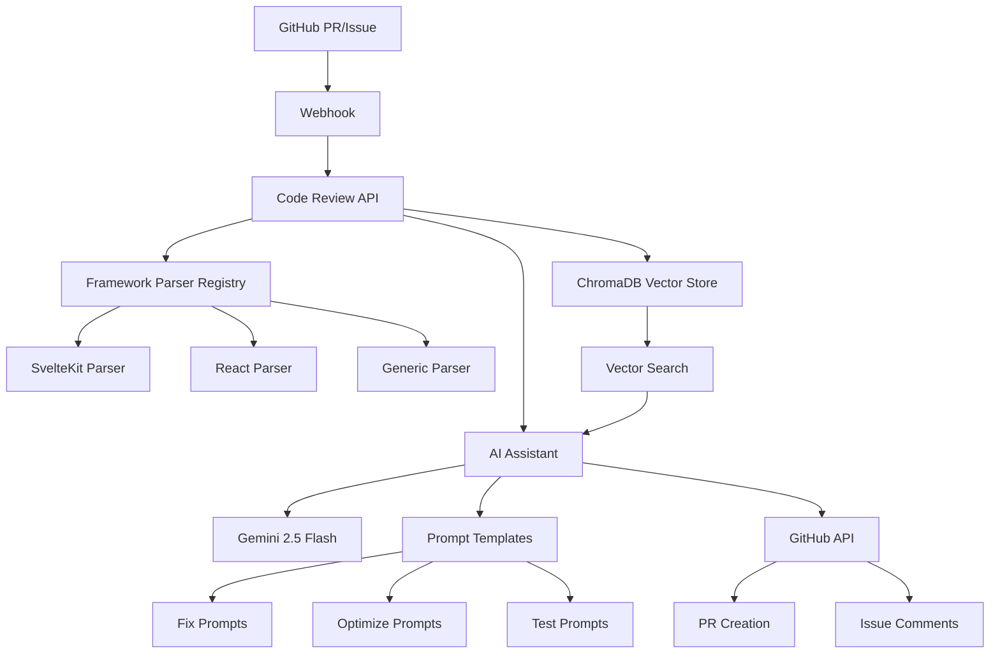

# Code Review API

An intelligent, framework-agnostic code review system powered by LLMs that provides contextual feedback on pull requests and responds to developer commands. Built with Bun, Hono, ChromaDB, and OpenAI embeddings.
> **Note:** This project is under heavy development, so you may encounter many bugs.

## Features

- **AI Assistant** - Interactive code assistant via `@starscream` mentions for fixes, optimizations, refactoring, and more
- **Contextual Code Analysis** - Uses vector embeddings to find relevant code patterns and context across any codebase
- **Framework Agnostic** - Supports any programming language and framework with extensible parsing system
- **GitHub Integration** - Automatic PR reviews and webhook-based assistant responses
- **Knowledge Base Support** - Includes framework-specific knowledge bases (Svelte 5, React, etc.)
- **Multi-language Support** - TypeScript, JavaScript, Python, Go, Rust, Svelte, React, Vue, and more
- **High Performance** - Built with Bun and ChromaDB for maximum speed and efficiency
- **Docker Ready** - Easy deployment with persistent vector storage

## Architecture



## Quick Start

### 1. Clone and Setup

```bash
git clone https://github.com/Dave-lab12/code-guardian/
cd code-guardian
cp .env.example .env
```

### 2. Environment Variables

```env
# Required
OPENAI_API_KEY=your_openai_api_key
GOOGLE_API_KEY=your_gemini_api_key
GITHUB_SECRET_KEY=your_webhook_secret
GH_ACCESS_TOKEN=github_token_for_api_access

# Optional
CHROMA_URL=http://localhost:8000
NODE_ENV=production
CHUNKS_DIR=/contents/mindplex-chunks
TEMP_DIR=/tmp
```

### 3. Run with Docker

```bash
# Development (includes ChromaDB)
docker-compose --profile dev up

# Production
docker-compose up
```

### 4. Initialize Codebase

```bash
curl -X POST http://localhost:3000/update-codebase \
  -H "Content-Type: application/json" \
  -H "x-github-secret: your_secret" \
  -d '{"repoUrl": "https://github.com/your/repo", "branch": "main"}'
```

## API Endpoints

### Health Check
```http
GET /
```
Returns service status and timestamp.

### Update Codebase
Clones and processes a repository, creating embeddings for all code chunks.

```http
POST /update-codebase
Content-Type: application/json
x-github-secret: your_secret

{
  "repoUrl": "https://github.com/user/repo",
  "branch": "main",
  "token": "optional_github_token"
}
```

### Review Code
Reviews code changes against the processed codebase.

```http
POST /review
Content-Type: application/json
x-github-secret: your_secret

{
  "files": [
    {
      "fileName": "src/app.ts",
      "changedCode": "function example() { ... }"
    }
  ],
  "description": "Add new feature"
}
```

### Webhook (AI Assistant)
Handles GitHub webhooks for `@starscream` mentions in issues and PRs.

```http
POST /webhook
Content-Type: application/json
x-github-event: issue_comment
x-github-secret: your_secret

{
  "action": "created",
  "issue": { ... },
  "comment": { "body": "@starscream fix this bug" },
  "repository": { "full_name": "user/repo" }
}
```

## 🤖 AI Assistant Usage

The AI assistant responds to `@starscream` mentions in GitHub issues and pull requests:

### Fix Issues
```
@starscream fix this memory leak in auth.ts
@starscream fix the validation bug in user registration
```

### Optimize Performance
```
@starscream optimize these database queries
@starscream improve the performance of this component
```

### Add Tests
```
@starscream add tests for the authentication module
@starscream create unit tests for this function
```

### Refactor Code
```
@starscream refactor this to use better patterns
@starscream clean up this messy component
```

### Add Documentation
```
@starscream document this API endpoint
@starscream add JSDoc comments to this function
```

### General Help
```
@starscream help me implement user roles
@starscream how should I structure this feature?
```

## GitHub Integration Setup

### 1. Webhook Configuration

**Option A: Repository Settings UI**
1. Go to Settings → Webhooks → Add webhook
2. Payload URL: `https://your-api-url.com/webhook`
3. Content type: `application/json`
4. Secret: Your `GITHUB_SECRET_KEY`
5. Events: Issue comments, Issues, Pull requests

**Option B: API Setup**
```bash
curl -X POST \
  https://api.github.com/repos/YOUR_USERNAME/YOUR_REPO/hooks \
  -H "Authorization: Bearer $GITHUB_ACCESS_TOKEN" \
  -H "Content-Type: application/json" \
  -d '{
    "name": "web",
    "config": {
      "url": "https://your-api-url.com/webhook",
      "content_type": "json",
      "secret": "'$GITHUB_SECRET_KEY'"
    },
    "events": ["issue_comment", "issues", "pull_request"],
    "active": true
  }'
```

### 2. Repository Secrets

Add these secrets in your repository settings:
- `REVIEW_API_URL` - Your API endpoint
- `REVIEW_SECRET` - Your GitHub secret key

### 3. PR Review Workflow

Create `.github/workflows/code-review.yml`:

```yaml
name: Code Review

on:
  pull_request:
    types: [opened, synchronize, reopened]

jobs:
  review:
    runs-on: ubuntu-latest
    steps:
      - uses: actions/checkout@v4
        with:
          fetch-depth: 0

      - name: Review and post
        env:
          REVIEW_API_URL: ${{ secrets.REVIEW_API_URL }}
          REVIEW_SECRET: ${{ secrets.REVIEW_SECRET }}
          GH_TOKEN: ${{ secrets.GITHUB_TOKEN }}
        run: |
          temp_files=()
          while IFS= read -r file; do
            if [[ -f "$file" && $(wc -c < "$file") -le 1048576 ]]; then
              content=$(cat "$file" | jq -R -s .)
              temp_file=$(mktemp)
              jq -n --arg filename "$file" --argjson content "$content" '{"fileName": $filename, "changedCode": $content}' > "$temp_file"
              temp_files+=("$temp_file")
            fi
          done < <(git diff --name-only origin/${{ github.base_ref }}...HEAD)

          if [ ${#temp_files[@]} -eq 0 ]; then
            review="No files to review"
          else
            files_json=$(jq -s . "${temp_files[@]}")
            rm -f "${temp_files[@]}"

            response=$(curl -s -f -X POST "$REVIEW_API_URL/review" \
              -H "Content-Type: application/json" \
              -H "x-github-secret: $REVIEW_SECRET" \
              -d "{\"files\": $files_json, \"description\": \"PR #${{ github.event.number }}: ${{ github.event.pull_request.title }}\"}")

            if [ $? -eq 0 ] && [[ $(echo "$response" | jq -r '.success') == "true" ]]; then
              review=$(echo "$response" | jq -r '.review')
            else
              review="Review failed: $(echo "$response" | jq -r '.error // "API error"')"
            fi
          fi

          gh api repos/${{ github.repository }}/issues/${{ github.event.number }}/comments \
            --method POST \
            --field body="## 🤖 Code Review

          $review"
```

## Framework Support

The system uses a plugin-based architecture to support any framework or language:

### Built-in Framework Parsers

**SvelteKit Parser:**
- Page routes (`+page.svelte`, `+page.server.ts`)
- Layout components (`+layout.svelte`)
- API endpoints (`+server.ts`)
- Load functions and actions

**Generic Parser:**
- TypeScript/JavaScript functions and classes
- Type definitions and interfaces
- Configuration files
- Documentation files

### Adding New Framework Support

1. **Create a parser class:**
```typescript
export class ReactParser implements FrameworkParser {
  async parseFile(filePath: string, config: PatternConfig): Promise<ParseResult[]> {
    // Parse React components, hooks, etc.
  }
}
```

2. **Define patterns:**
```typescript
export const reactPatterns: FrameworkPatterns = {
  components: {
    pattern: "**/*.{jsx,tsx}",
    type: "component",
    semantic: "ui-component",
    priority: 10
  },
  hooks: {
    pattern: "**/use*.{js,ts}",
    type: "hook",
    semantic: "logic-hook",
    priority: 9
  }
};
```

3. **Register the parser:**
```typescript
parser.register(reactPatterns, new ReactParser(), {
  knowledge: ['src/prompts/react19.txt']
});
```

## Knowledge Base System

Add framework-specific knowledge to improve AI responses:

### 1. Create Knowledge Files

```
src/prompts/svelte5.txt     # Svelte 5 runes, components
src/prompts/react19.txt     # React 19 features, patterns
src/prompts/nextjs14.txt    # Next.js app router, server components
src/prompts/vue3.txt        # Vue 3 composition API
```

### 2. Format with Sections

```markdown
# React 19 Knowledge

## Server Components
React Server Components run on the server and stream UI to the client...

## Concurrent Features
React 19 includes automatic batching, suspense improvements...

## Best Practices
- Use server components for data fetching
- Client components for interactivity
- Proper error boundaries
```

### 3. Register with Parser

```typescript
parser.register(reactPatterns, new ReactParser(), {
  knowledge: ['src/prompts/react19.txt']
});
```

## Supported File Types

- **Frontend**: `.js`, `.ts`, `.jsx`, `.tsx`, `.vue`, `.svelte`
- **Backend**: `.py`, `.go`, `.rs`, `.php`, `.rb`, `.java`, `.cs`
- **Styles**: `.css`, `.scss`, `.sass`, `.less`, `.styl`
- **Config**: `.json`, `.yaml`, `.yml`, `.toml`, `.env`
- **Docs**: `.md`, `.txt`, `.rst`, `.html`
- **Data**: `.sql`, `.graphql`, `.proto`

## Deployment Options

### Docker Production

```bash
# Build
docker build -t code-review-api .

# Run with ChromaDB
docker run -d \
  --name code-review \
  -p 3000:3000 \
  -e OPENAI_API_KEY=your_key \
  -e GOOGLE_API_KEY=your_gemini_key \
  -e GITHUB_SECRET_KEY=your_secret \
  -e CHROMA_URL=http://chroma:8000 \
  code-review-api
```

### Render.com

1. **Connect repository** to Render
2. **Set environment variables** in dashboard
3. **Enable persistent disk** (10GB recommended)
4. **Deploy** - automatic builds on push

### Self-Hosted

```bash
# Install dependencies
bun install

# Set up ChromaDB
docker run -d -p 8000:8000 --name chroma chromadb/chroma

# Run the API
bun run dev
```

## Configuration

### File Paths
```typescript
{
  codebaseRoot: process.env.CODEBASE_ROOT || process.cwd(),
  chunksDir: process.env.CHUNKS_DIR || 'contents/mindplex-chunks',
  promptsDir: 'src/prompts',
  tempDir: process.env.TEMP_DIR || '/tmp'
}
```

### Vector Database
```typescript
{
  chromaUrl: process.env.CHROMA_URL || 'http://localhost:8000',
  embeddingModel: 'text-embedding-3-small',
  collection: 'code_chunks',
  batchSize: 100
}
```

### AI Models
```typescript
{
  reviewModel: 'gemini-2.5-flash',
  embeddingModel: 'text-embedding-3-small',
  maxTokens: 4096,
  temperature: 0.1
}
```

## Usage Examples

### Manual Code Review
```bash
curl -X POST http://localhost:3000/review \
  -H "Content-Type: application/json" \
  -H "x-github-secret: your_secret" \
  -d '{
    "changedCode": "const users = await db.users.findMany(); return users.map(u => ({ id: u.id, name: u.name }));",
    "fileName": "api/users.ts",
    "description": "Optimize user fetching"
  }'
```

### Test Assistant Locally
```bash
curl -X POST http://localhost:3000/webhook \
  -H "Content-Type: application/json" \
  -H "x-github-event: issue_comment" \
  -H "x-github-secret: your_secret" \
  -d '{
    "action": "created",
    "issue": {
      "number": 123,
      "title": "Performance issue",
      "body": "API is slow"
    },
    "comment": {
      "body": "@starscream optimize this API endpoint"
    },
    "repository": {
      "full_name": "test/repo"
    }
  }'
```

## Review & Assistant Output

### Code Review Features
- **Critical Issues** - Security vulnerabilities, bugs
- **Performance** - Optimization opportunities, bottlenecks
- **Best Practices** - Framework patterns, conventions
- **Maintainability** - Code organization, readability
- **Testing** - Missing tests, edge cases

### Assistant Capabilities
- **Bug Fixes** - Generates actual code fixes for issues
- **Performance Optimization** - Suggests and implements improvements
- **Test Generation** - Creates comprehensive test suites
- **Code Refactoring** - Restructures code for better patterns
- **Documentation** - Adds JSDoc, README, API docs
- **Architecture Advice** - High-level design recommendations

## Development

### Local Development
```bash
# Install dependencies
bun install

# Start ChromaDB
docker run -d -p 8000:8000 chromadb/chroma

# Run in development mode
bun run dev
```

### Testing
```bash
# Health check
curl http://localhost:3000/

# Test code review
curl -X POST http://localhost:3000/review \
  -H "Content-Type: application/json" \
  -H "x-github-secret: test" \
  -d '{"changedCode": "console.log(\"test\")", "fileName": "test.js"}'

# Test assistant
curl -X POST http://localhost:3000/webhook \
  -H "Content-Type: application/json" \
  -H "x-github-event: issue_comment" \
  -H "x-github-secret: test" \
  -d '{"action": "created", "comment": {"body": "@starscream help"}, "issue": {"number": 1}, "repository": {"full_name": "test/repo"}}'
```

## Troubleshooting

### Common Issues

**ChromaDB Connection Failed**
- Ensure ChromaDB is running: `docker ps | grep chroma`
- Check CHROMA_URL environment variable
- Verify network connectivity

**"No embeddings found"**
- Run `/update-codebase` endpoint first
- Check if repository cloning succeeded
- Verify supported file types in your repo

**Assistant not responding**
- Check GitHub webhook delivery in repo settings
- Verify `x-github-secret` header matches
- Ensure `@starscream` mention format is correct

**High memory usage**
- Adjust batch size in configuration
- Consider chunking large repositories
- Monitor ChromaDB memory usage

## Contributing

1. Fork the repository
2. Create feature branch (`git checkout -b feature/new-parser`)
3. Add framework parser with tests
4. Update documentation
5. Submit pull request

### Adding Framework Support

1. **Create parser** in `src/frameworks/your-framework/`
2. **Define patterns** for file matching
3. **Add knowledge base** in `src/prompts/`
4. **Write tests** for parser functionality
5. **Update README** with framework info

## Tech Stack

- **Runtime**: [Bun](https://bun.sh) - Fast JavaScript runtime
- **Framework**: [Hono](https://hono.dev) - Lightweight web framework  
- **Vector DB**: [ChromaDB](https://www.trychroma.com) - Vector database for embeddings
- **Embeddings**: [OpenAI](https://openai.com) - text-embedding-3-small
- **AI Model**: [Google Gemini](https://ai.google.dev) - Gemini 2.5 Flash
- **GitHub**: [GitHub API](https://docs.github.com/en/rest) - Webhooks and PR automation
- **Deployment**: [Docker](https://docker.com) - Containerized deployment

## License

MIT License - see [LICENSE](LICENSE) file for details.

